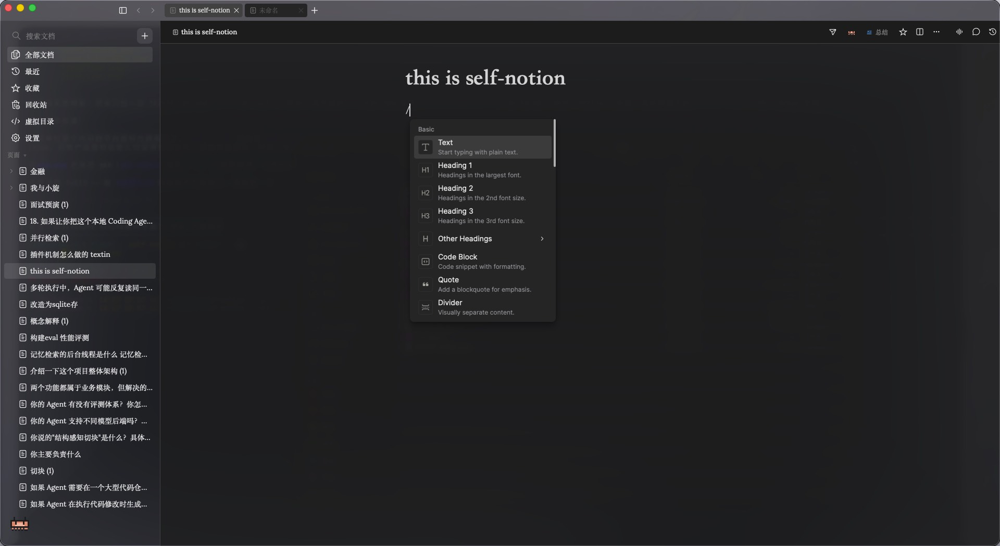
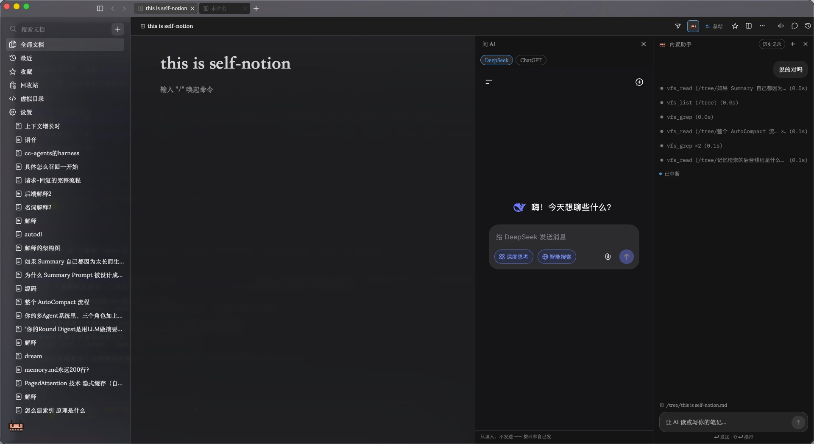
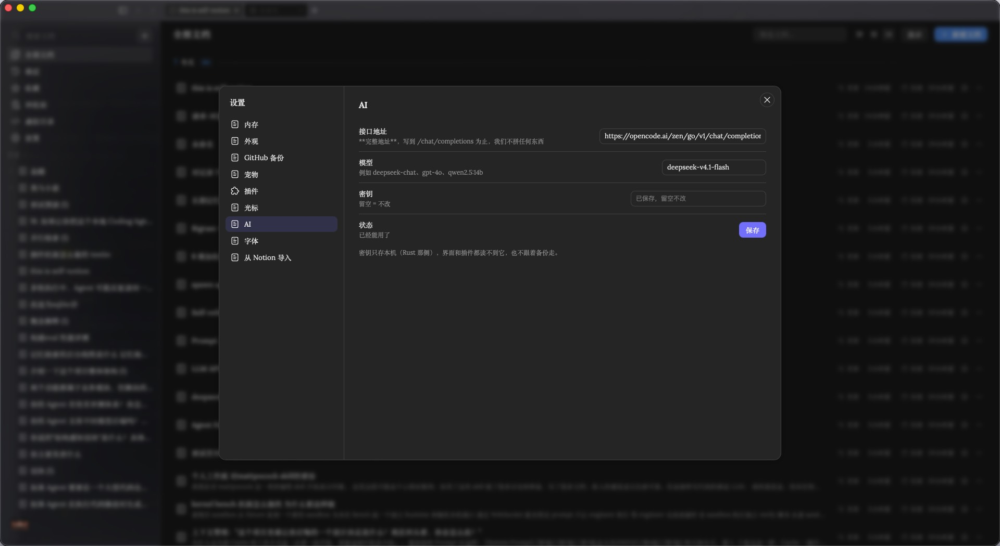
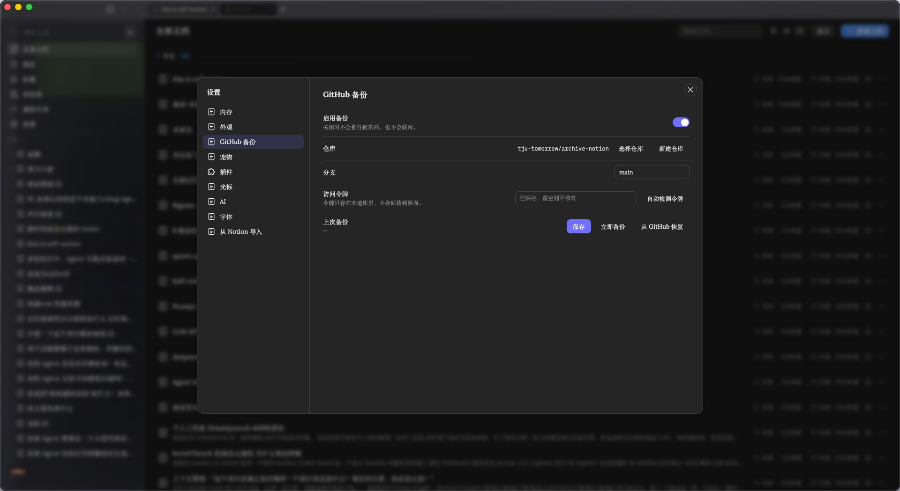
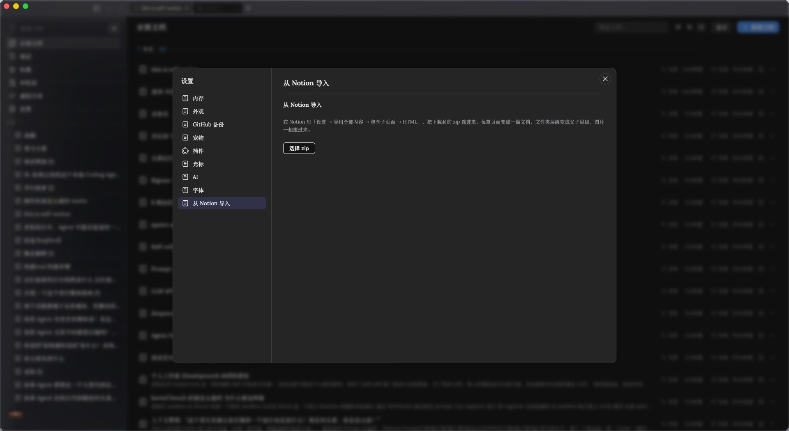

# self-notion

**English** | [中文](README.zh-CN.md)

**A tiny, extremely fast local Notion base — built for one person.** Desktop (macOS), fully local,
offline by default, no login.

Not a Notion replacement, and not a product I intend to ship — it's **my own writing +
extension platform**. The document model and the editor are borrowed whole; everything above
them (plugins, AI, the retrieval surface for agents) is grown here.

> The architecture follows **DeepSeek Harness (DSH)'s "everything is a plugin"**, and uses DSH's
> own kernel, Cordis. See section 4.

---

## Screenshots

**The main page and the `/` menu** — one workspace, from the document tree down to the slash menu, all drawn by hand:



**Asking AI, and seeing what it read** — the assistant answers from your own notes and shows every `vfs_grep` / `vfs_read` it ran, so an answer can be traced back to the passage it came from:



**The three settings that matter** — bring your own endpoint, back up to a private GitHub repo, or pull existing Notion pages in:

<p>



</p>

---

## 1. What it does

**Writing**
- Block editor (vendored BlockSuite 0.22.4): paragraph / heading / lists / to-do / **toggle** /
  quote / code / divider / table / image / attachment / callout
- Slash menu, Notion keybindings, block dragging, find & replace, outline rail
- Sub-pages, `@`-mentions, doc-to-doc links, backlinks

**Organizing**
- Sidebar doc tree (create / rename / move / delete), **tabs**, **multiple windows**
- Home (list / grid, grouped by update time), favorites, recents, trash

**Retrieval**
- **⌘K full-text search** (SQLite FTS5): search box on top, segmented list + body preview below,
  three caches pre-warmed
- **Virtual document directory**: the whole library projected as a directory tree —
  `tree/` `by-tag/` `by-date/` `links/to/` `search/` … The directory name *is* the query.
  A read-only browser page in the sidebar, exposed to agents as MCP tools

**AI**
- **Built-in assistant**: full page + a right-hand column, BYO endpoint (baseURL / model / key),
  **can ask and can write**
- **Rust forces a snapshot before every write**; the undo strip reverts by *turn* (one answer that
  touched 3 docs reverts in one go)
- Per-doc one-line / one-paragraph summary + extracted entities
- **Web AI column**: chat.deepseek.com / chatgpt.com inside the right column (native child webview,
  login kept alive); send a selection into its input box in one click
- **MCP**: `self-notion --mcp` is a separate read-only process wired straight to the DB, so external
  agents can grep your notes

**Comments / versions**
- Comments: page / block / inline anchors, replies, resolve, delete
- Version history: timeline panel in the header; checkpoints before AI writes, on doc close, every 10 min

**Data**
- **Zero-wait image paste**: bytes go straight into SQLite, deduped by sha256, no extra local directory
- **One-way Markdown backup to GitHub** (off by default; readable and diffable on the web)
- **Notion import**: HTML export zip → one doc per page, folder hierarchy → parent/child, images into the blob store

**Look & shell**
- Frameless window with vibrancy, light/dark, **paper texture** for the body, three-level fonts
  (global / article / code)
- Chinese + English UI, shortcut cheatsheet, a **pixel pet** in the sidebar, memory readout in the menu bar

**Extension**
- **Everything is a plugin**: a feature = one plugin directory (25 today); remove it and the system
  returns exactly to its pre-load state
- In-app extension market (install / uninstall / enable, third-party plugins sandboxed in module
  Workers) — **planned**

---

## 2. Where it beats Notion

| # | self-notion | Notion |
| --- | --- | --- |
| 1 | **Your data is one file**: `self-notion.db` (SQLite), on your own disk. No login, offline by default | Cloud SaaS: account, subscription, mostly unusable offline, data on someone else's server |
| 2 | **Tiny and fast**: Tauri 2 shell, **no bundled browser engine**; tabs are free, windows are not | Electron-class size; the web app reloads a whole application every time |
| 3 | **Everything is a plugin, uninstall is a full undo**: the kernel only loads, unloads and resolves dependencies — it doesn't know what a "document" is | Closed: extension means API bolt-ons; the core is not extensible |
| 4 | **A virtual document directory for agents**: the library projects into a tree where the directory name is the query; agents use `ls` / `grep` / `cat` — **no RAG** | Doesn't exist. Notion AI is a black box |
| 5 | **A built-in AI that can write — and always roll back**: BYO endpoint, edits your notes, **forced snapshot before every write**, undo by turn | AI output lands in the body; rolling back is manual |
| 6 | **Zero-wait image paste**: bytes to SQLite, deduped by sha256, no extra local directory | "Uploading…" |
| 7 | **Two windows on one doc share one source of truth**: Rust relays CRDT updates (Yjs is a CRDT to begin with) | The same page open twice overwrites itself / goes read-only |
| 8 | **One-way Markdown backup to GitHub** (off by default) — a copy you can read, diff and take with you | Export is a feature, not a continuous backup |
| 9 | **You own the UI at every scale**: the block editor is a vendored engine; the shell, menus, keybindings and paper texture are all written here | You wait for the roadmap |

### 1, expanded: why "one .db" is an advantage

There is exactly one `self-notion.db` on disk (plus backup output). Documents, the full-text index,
images, comments, versions and UI state all live inside it.

```sql
documents    doc metadata (parent/child tree, favorites, trash)  ← Rust is the source of truth
doc_snapshot  Yjs state snapshot
doc_update    Yjs increments (which doubles as version history)
doc_version   checkpoints (before AI writes / on doc close / every 10 min)
doc_fts       FTS5 full-text index
doc_text      Markdown projection      ┐
doc_link      link graph (@mentions + ┘ one projection, reused three ways:
blob          images / attachments       grep corpus · vfs:read content · backup output
comment       comments (anchors live in the body, resolve state here)
meta          key-value (including all UI state)
```

The cost is written down in `positioning.md`: images aren't visible outside the DB, and pulling one
out means going through export.

### 4, expanded: the virtual document directory (a layer Notion simply doesn't have)

```
/
├── index.md      generated: stats · tags · recent
├── tree/         the one real hierarchy
├── by-tag/  by-date/  recent/  favorites/
├── links/to/<doc>.md     backlinks (the fastest path to context)
├── links/from/<doc>.md   outlinks
├── search/<q>/           dynamic: one query = one directory listing
└── outline/  trash/
```

**Directory = query.** One document lives under many directories at once, so organization becomes
infinite, composable, and requires no upfront modeling. Notion has exactly one tree.

**Why not RAG:** DCI (2026) swapped embeddings for grep on the same benchmark and went from 69% to
80% accuracy while cutting cost by a third; Mintlify replaced RAG with a virtual filesystem and took
p90 session creation from ~46s to ~100ms. The more important asymmetry: **vector retrieval fails
convincingly; grep fails visibly.**

It's exposed as **MCP tools** (`self-notion --mcp`, a separate read-only process), not FUSE.

### 5, expanded: an AI that can write, but always rolls back

- **The key never leaves Rust** — baseURL / model / key live in Rust + the macOS Keychain; the webview never sees plaintext
- **The AI doesn't get to decide it's irreversible** — "snapshot before write" is enforced by **Rust**, not left to the model's discretion
- **The unit of undo is the turn, not the document** — one answer that touched 3 docs shares a `group_id` and reverts together
- **Snapshots only, no `Y.UndoManager`** — the latter's stack lives in memory and dies with the document

Writes come in three shapes: `create` / `append` / `replace` (by block id). **No whole-document
overwrite** (it would drop block metadata), and **no delete**.

---

## 3. Costs and explicit non-goals

- **The UI is written here** — sidebar, tab strip, search, settings, all from scratch. What that buys:
  skipping AFFiNE's 113 MB renderer and 53 MB `@affine/core`
- **Memory has a floor** — as long as the UI is drawn by a webview, a single window has a floor.
  Getting to 30–60 MB means not using a webview, which means rewriting the editor (ruled out)
- **"Everything is a plugin" is not free** — one kernel layer plus a manifest and lifecycle discipline per plugin
- **Third-party plugins can only compose existing capabilities inside a sandbox** — pure front-end JS,
  no disk, no network, **no bundled Rust** (deliberate)
- **Backup means data leaves this machine** — hence "fully local" is restated as "local by default;
  network only where you explicitly turn it on"

Not doing (frozen): databases with multiple views (Notion's soul, D-0008) ·
whiteboard canvas · accounts / cloud sync / collaboration · journal / templates ·
formulas / web embeds / bookmarks · mobile / web · telemetry / auto-update · theme editor

> **The one-line test: if a feature doesn't help me write faster or extend more easily, it doesn't get built.**

**Not built yet** (in priority order): the extension market · doc title and body measure in
the editor · dedicated pages for recents / favorites / trash · home collections and tags are empty
states · virtualized card grid · databases / whiteboard / collaboration / mobile.

---

## 4. Architecture: borrowed from DeepSeek Harness's "everything is a plugin"

**This was a user decision, D-0031 / D-0032:** "Follow DeepSeek Harness's architecture so extending
is easy — easy enough that other people can extend it too" / "an extension market, so every new
feature I build plugs in and out simply."

### What was borrowed

DSH's **reasoning** is what convinced us: in Claude Code / Codex, the harness is a fixed shell that
can only be extended through MCP / API and is **never replaceable**. DSH moved that line — the
harness itself is assembled from plugins, so the boundary between "product" and "extension" doesn't
exist. Its four presets (Standard / PTC / Minimal / Creative) are **not four codebases; they are four
plugin manifests.**

So:

1. **Kernel = Cordis** (npm `cordis`, MIT, extracted by Koishi's author Shigma; ~2000 lines of TS,
   **zero runtime dependencies**). Not invented here — DSH vendors it too rather than rewriting it.
   The kernel does three things: **load, unload, resolve dependencies**. It doesn't know the words
   "document", "editor" or "sidebar". **The editor itself is a plugin.**
2. **Two primitives are the entire meaning of "plugs in and out"**
   - `inject` — **dependency-driven loading**: missing dependency, no load; the dependency disappears
     and the plugin unloads itself, comes back and it reloads. Consequence: swap `storage` from
     SQLite to something else and `editor` doesn't change a line
   - `ctx.effect` — **reversible side effects**: everything registered through `ctx` (listeners,
     commands, slots, block types) is **undone in reverse on unload**. **You never call a disposer
     by hand.** HMR comes free
3. **The formats are copied too** — `selfNotion.bundle` → `sn.patch.yml`, matching DSH's
   `dsh.bundle` → `cordis.patch.yml`

### Where it deliberately differs

| Dimension | DeepSeek Harness | self-notion |
| --- | --- | --- |
| Kernel | Cordis (vendored as `@deepseek-ai/cordis`) | **`cordis` (the npm package directly)** |
| Manifest | `dsh.bundle` → `cordis.patch.yml` | `selfNotion.bundle` → `sn.patch.yml` |
| Distribution | `dsh plugin add` (delegates to pnpm) | **In-app market** — a desktop app can't assume node is installed |
| Hot-load | patch read at startup; the community had to write `dsh-hot-installer` | **Built into the kernel from v1**, so nobody has to patch around it |
| Sandbox | mods are unsandboxed (**the called-out problem**) | **webview + Tauri capability, two boundaries** |
| Missing manifest | Fails silently | **The admin page says so loudly** — in DSH's audit only 11 of 101 plugins worked out of the box, and this was the main cause; we skip that lesson |
| Self-modification | Agent hot-mounts plugins (`cordis_define` / `cordis_run`) | Hook left open, not built yet |

**The security row matters most**: what DSH got called out for is exactly that "plugins can touch
files, sessions and the agent's decision path, and mods are unsandboxed." Our third-party plugins are
**single-file ESM running in a module Worker** — **a Worker has no DOM and cannot reach
`window.__TAURI_INTERNALS__`**, so "could a malicious plugin quietly call IPC?" isn't a question.
(This also sidestepped a CSP hole: the original plan's Blob → `import()` hit `CVE-2026-95626`, i.e.
the very step that made it work was the step the advisory calls a vulnerability.)

### Where the theory comes from

Cordis splits composability in two (paper: *A Programming Paradigm for Spatiotemporal Composability*,
DeepSeek-AI + Peking University, 2026-08-13, **preprint, not peer-reviewed**): the **time dimension**
(reversible side effects) and the **space dimension** (reactive co-effects), plus **path
independence** as a measurable property — which we turned into a CI test: **mount and unmount
plugins at random N times; the final state snapshot must be byte-identical.**

> The motivating number stings: **87 of VSCode's top 100 extensions cannot be unloaded at runtime.**

### One page

```
┌──────────────────────────────────────────────────────────┐
│  WKWebView (one per window)                              │
│   Cordis kernel — loads, unloads, resolves dependencies    │
│      │ inject (declare deps)   │ ctx.effect (reversible)   │
│   plugins/  ← a directory is a plugin, no central registry │
│      the only outward channel: ctx.rpc                    │
└──────────────────────┬───────────────────────────────────┘
                       │ one entry point: api({ method, args })
┌──────────────────────▼───────────────────────────────────┐
│  Tauri core process (Rust) — capability provider, no plugins│
│   SQLite (Yjs / FTS5 / blob / version) · files · backup · AI│
│   · VFS · event bus · multi-window CRDT relay              │
└──────────────────────────────────────────────────────────┘
```

**Three claims**

1. **A tiny kernel, everything else a plugin** — a feature is a plugin directory; remove it and the
   system returns exactly to its pre-load state
2. **Rust owns capabilities, the front end owns composition** — data, files and network all live in
   Rust; UI and plugins all live in the webview
3. **One type source** — `apps/desktop/src/kernel/contract.ts`; commands go through a single generic
   entry point, and drift is caught by `cargo test` (D-0049)

**Command namespaces**: `doc` `search` `blob` `settings` `backup` `vfs` `ai` `aiweb` `version` `mcp` `mem` `window`

**Multiple windows**: one Tauri process holds the SQLite file; a new window is another window;
**tabs inside a window are a state array** (tabs are free, windows are not). When two windows have
the same doc open, whichever update arrives is broadcast by Rust to the other windows' Y.Docs —
**Rust never parses Yjs, it only forwards bytes.**

### Where it lands: one feature, one plugin directory

25 directories under `apps/desktop/plugins/`. **A directory is a plugin; remove any one and the app
still runs.**

| Plugin | What it does |
| --- | --- |
| `editor-blocksuite` | Provides `ctx.editor`. Lazy-loads BlockSuite; slash menu, Notion keybindings, block dragging, inline comment anchors |
| `plugin-storage` | `ctx.docs` — the editor↔storage contract, **three methods only**: `load` / `save` / `delete` |
| `shell-sidebar` `shell-tabs` `shell-nav` `shell-doc-header` `shell-settings` | Shell: doc tree, tab strip, back/forward, breadcrumb + ⋯ menu, settings page |
| `home` | The page shown with no document open (list / grid, grouped by update time) |
| `search-panel` | ⌘K full-text search (FTS5): segmented list + body preview, three caches |
| `blob` | Images / attachments: paste / drop / pick → sha256 into the DB, **zero-wait paste** |
| `comment` | Page / block / inline anchors, replies, resolve, delete |
| `version-history` | Timeline panel + checkpoints (on leave / every 10 min / before AI writes) |
| `ai` `tools` | Built-in assistant (full page + right column) + six tools (three read `vfs_*`, three write `doc_*`) + undo strip |
| `ai-summary` | Per-doc one-liner / paragraph + entities, persisted |
| `ai-web` | Web AI in the right column (native child webview, kept alive), fill its input from a selection |
| `vfs` | `ctx.vfs` — the virtual document directory, with a read-only browser page |
| `backup-github` | One-way Markdown push to GitHub, settings section + repo picker |
| `import-notion` | Notion HTML export zip → one doc per page (folders → parent/child, images into blob) |
| `appearance` | Language / light-dark / paper texture / shortcut cheatsheet |
| `mascot` | The pixel pet in the sidebar (frames are generated procedurally, no image assets, works offline) |
| `mem-monitor` | Memory number in the macOS menu bar + detail sections (**WebContent processes counted in**) |
| `plugin-rpc` `plugin-settings` `plugin-command` | Kernel services: the only channel to Rust / key-value settings / command registry |

---

## 5. Stack

| Layer | Choice | Version |
| --- | --- | --- |
| Shell | Tauri 2 (not Electron) | ^2 |
| Kernel | Cordis (MIT, zero runtime deps) | `4.0.0-rc.10` |
| Editor | BlockSuite (official packages, **itself a plugin**) | `@blocksuite/affine` 0.22.4 |
| Rendering | React 19 (core APIs only, Preact kept as an option) | ^19 |
| Data | SQLite (WAL) storing Yjs updates; FTS5 full text; blobs in the DB | Yjs 13.6.33 |
| Styles | vanilla-extract + `@toeverything/theme`'s `--affine-*` variables | |
| Packages | pnpm workspace | 10.18.0 |

Types: TS `strict`, no `any`; Rust 2021, `clippy -D warnings`.

---

## 6. Getting started

```sh
pnpm install
pnpm dev                    # dev (Tauri + Vite)
pnpm build                  # build

pnpm verify                 # tsc + oxlint + cargo clippy -D warnings (the only check after a change)
pnpm logs                   # tail errors.log
```

**Every error that can stop you running lands in one file** — the UI also surfaces the last few in the
top-right corner, so you never need DevTools:

```
~/Library/Application Support/app.selfnotion.desktop/errors.log
```

---

## 7. Layout

```
self-notion/
├── app.png                 product icon (1254² source; `pnpm tauri icon app.png` generates the set)
├── *.jpg                   screenshots used by this file (see the top)
├── apps/desktop/
│   ├── plugins/            ★ a directory is a plugin, one feature per directory
│   ├── src/kernel/         contract.ts + Cordis loader + slots + the single error sink
│   ├── src/shell/          shell skeleton (builds the frame, mounts the slots)
│   ├── src/ui/             UI shared across plugins (confirm dialog, toast, settings rows)
│   └── src/{theme,i18n}/
├── src-tauri/
│   ├── icons/              bundle icons (generated by `tauri icon`; change app.png and re-run)
│   └── src/                capability provider
│       ├── store/          SQLite: schema.sql · docs · blob · comment · version · links · summary
│       ├── commands/mod.rs ★ the single command entry, api()
│       └── {ai,aiweb.rs,vfs,backup,mcp,mem}.rs · windows.rs · log.rs
└── CONVENTIONS.md          the law when several agents build in parallel
```

---

## 8. Ground rules (read `AGENTS.md` before changing code)

1. **Few comments** — one line saying *why*; the reasoning goes in the decision log
2. **No `*.test.ts`** — verify by printing
3. **One error sink** — `errors.log`; don't drop errors into `console.log`
4. **Only write files inside your own plugin directory**; get capabilities only through `ctx`;
   **every `register()` needs its `unregister()`**
5. **Every plugin comes with two checks**: it loads, and **the app doesn't crash after unloading it**
